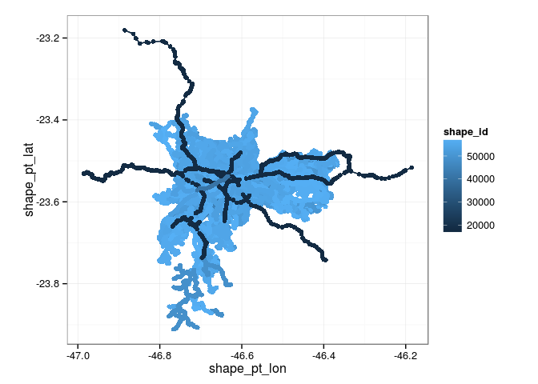
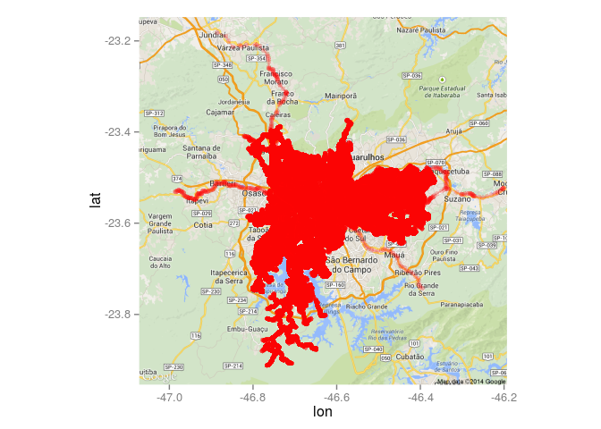

# SPTrans


```r
# Bibliotecas usadas
library(dplyr)
library(ggplot2)
load('shapes.RData')
```


```r
p <- shapes %>%
  ggplot(aes(x=shape_pt_lon, y=shape_pt_lat, colour=shape_id, group=shape_id)) +
  geom_path(alpha=.1) +
  coord_equal() +
  theme_bw()
print(p)
```

 


```r
library(ggmap)
map <- get_map(location = 'São Paulo, SP, Brazil', zoom = 10, maptype='roadmap')
p <- map %>% ggmap +
  geom_path(aes(x=shape_pt_lon, y=shape_pt_lat, group=shape_id), colour='red', data=shapes, alpha=.1)
print(p)
```

 

